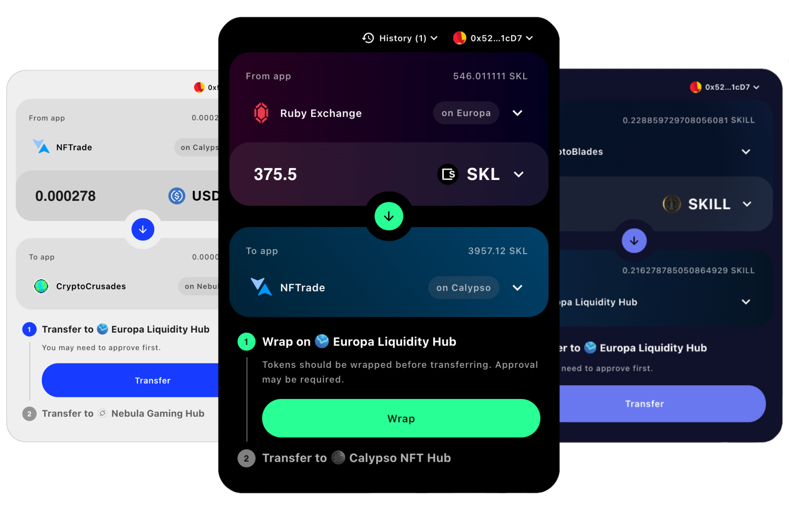

# SKALE Metaport Integration Demo

[](https://discord.gg/vvUtWJB)

This repository provides a hands-on example of how to integrate the SKALE Metaport Widget into your React project.



## Getting Started

1. Clone this repo

```bash
git clone https://github.com/skalenetwork/metaport-integration-demo.git
```

2. Install dependencies

```bash
bun install # or yarn install
```

3. Optional: set environement variable for WalletConnect wallets

```
echo VITE_WC_PROJECT_ID=[your project id] > .env
```

4. Run dev server

```bash
bun dev # or yarn dev
```

5. Customize config in `src/metaportConfig.ts`

You can check out mainnet config example in the [SKALE Portal repo](https://github.com/skalenetwork/portal/blob/main/config/mainnet.ts).

## Contributing

We welcome contributions to the SKALE Metaport Widget Integration Demo! Please read through our contributing guidelines to learn about our submission process, coding standards, and more.

## License


All contributions are made under the [GNU Lesser General Public License v3](https://www.gnu.org/licenses/lgpl-3.0.en.html). See [LICENSE](LICENSE).